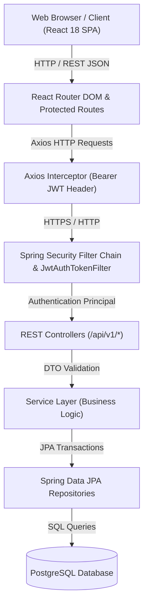
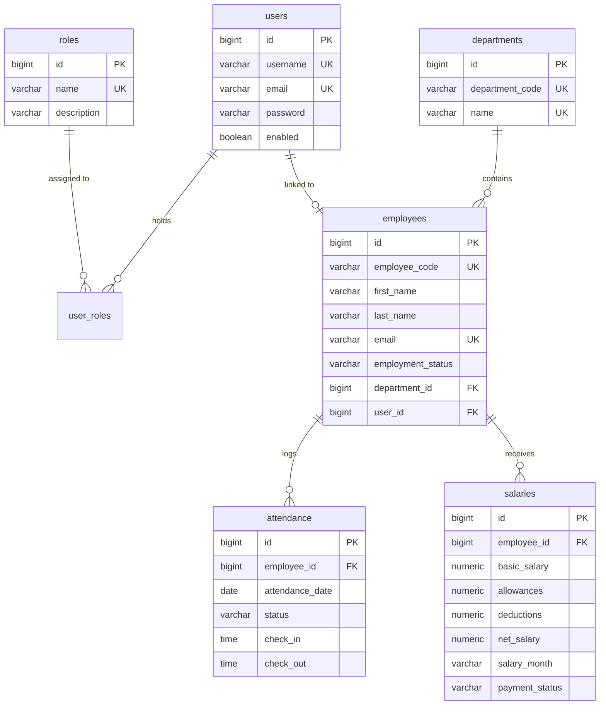

# WorkPulse — Employee Management System
## Full-Stack Academic & Technical Project Report

---

### Executive Abstract

**WorkPulse** is an enterprise-grade, full-stack Employee Management System (EMS) designed to streamline organizational human resource workflows, personnel record keeping, departmental structure, attendance tracking, and payroll processing. 

Built using a decoupled client-server architecture, WorkPulse pairs a robust **Java 17 Spring Boot 3.x** backend with a modern **React 18 + Vite** single-page application (SPA) styled using **Material UI**. Security is established via **Spring Security** and stateless **JSON Web Tokens (JWT)** with **BCrypt** password encryption and strict **Role-Based Access Control (RBAC)** across three authority tiers: `ROLE_ADMIN`, `ROLE_HR`, and `ROLE_EMPLOYEE`. Data persistence is managed by **Spring Data JPA** and **PostgreSQL** with complete referential integrity, indexes, and soft-deletion strategies.

---

## 1. Introduction & Objectives

### 1.1 Problem Statement
Modern organizations face significant administrative overhead when attempting to manage employee profiles, department hierarchies, daily attendance, and monthly salary slips using disconnected spreadsheets or legacy manual systems. Manual tracking leads to data inconsistencies, unauthorized access, lack of auditability, security vulnerabilities, and inefficient payroll calculations.

### 1.2 System Objectives
The primary objective of WorkPulse is to deliver a secure, centralized, responsive, and automated web portal that provides:
1. **Secure Authentication & RBAC**: Stateless JWT-based authentication ensuring strict authorization for Administrators, HR personnel, and Employees.
2. **Comprehensive Employee Directory**: Full CRUD management with multi-attribute search, department filtering, status tracking (`ACTIVE`, `INACTIVE`, `ON_LEAVE`, `TERMINATED`), and server-side pagination.
3. **Organizational Hierarchy**: Management of departments and security roles.
4. **Attendance Tracking & Self-Service**: Dedicated daily attendance logging, date filtering, and self check-in / check-out capabilities for employees.
5. **Payroll & Salary Management**: Authoritative server-side Net Salary calculation (\(\text{Net Salary} = \text{Basic} + \text{Allowances} - \text{Deductions}\)) with Indian Rupee (`₹`) formatting.
6. **Executive & Self-Service Dashboards**: Aggregated organization metrics for Admin/HR and personalized status cards for employees.

---

## 2. Technology Stack

### 2.1 Backend Frameworks & Libraries
* **Language & Runtime**: Java 17 LTS
* **Framework**: Spring Boot 3.2.5
* **Security & Auth**: Spring Security 6.x, io.jsonwebtoken (jjwt 0.11.5), BCrypt Password Encoder
* **Persistence & ORM**: Spring Data JPA, Hibernate ORM 6.4
* **Database Driver**: PostgreSQL JDBC Driver
* **Validation**: Jakarta Bean Validation (`@NotBlank`, `@Email`, `@Min`)
* **Build System**: Apache Maven 3.x (with Maven Wrapper `mvnw`)

### 2.2 Frontend Frameworks & Libraries
* **Core Library**: React 18
* **Build Tool**: Vite 5.x
* **UI Framework**: Material UI (MUI v5)
* **HTTP Client**: Axios (with centralized Bearer Token interceptor)
* **Routing**: React Router DOM v6
* **Typography & Styling**: Vanilla CSS & MUI Emotion Styling Engine

### 2.3 Database Management System
* **Engine**: PostgreSQL 18+ / 14+
* **Dialect**: `org.hibernate.dialect.PostgreSQLDialect`

---

## 3. System Architecture & Component Interaction

WorkPulse adopts a classic 3-tier monolithic REST API architecture with a completely decoupled SPA frontend.



---

## 4. Database Design & Schema Specification

The relational schema comprises seven core tables enforcing foreign key integrity, compound unique constraints, and B-tree indexes.

### 4.1 Entity Relationship Diagram



---

## 5. Functional Module Breakdown

### 5.1 Authentication & Security Module
* **JWT Token Lifecycle**: Upon valid credentials submission to `/api/v1/auth/login`, the server generates a signed HMAC-SHA256 JWT containing the username and granted authorities (`ROLE_ADMIN`, `ROLE_HR`, `ROLE_EMPLOYEE`).
* **Stateless Authorization**: `JwtAuthTokenFilter` intercepts every incoming request, validates signature and expiration, builds `UsernamePasswordAuthenticationToken`, and injects it into `SecurityContextHolder`.

### 5.2 Employee Management Module
* **CRUD & Pagination**: Admin and HR users can create, view, update, and soft-delete employees via paginated queries (`Page<EmployeeResponse>`).
* **Soft Deletion**: Deactivating an employee updates `employment_status` to `TERMINATED` rather than physically deleting rows, preserving historic attendance and payroll records.
* **IDOR Protection**: Employees requesting `/api/v1/employees/{id}` can only view their own profile; requests for other employee IDs trigger `403 Access Denied`.

### 5.3 Department & Role Management Module
* **Department Hierarchy**: Manage department codes, names, and descriptions with uniqueness constraints. Deleting a department with active employees is blocked to prevent orphaned records.
* **Security Roles**: Role creation and assignment restricted exclusively to `ROLE_ADMIN`.

### 5.4 Attendance Module
* **Daily Attendance Management**: Admin and HR can log, update, or filter attendance records by employee, date range, or status (`PRESENT`, `ABSENT`, `HALF_DAY`, `LEAVE`).
* **Employee Self Check-In / Check-Out**: Employees perform self check-in (`POST /api/v1/attendance/check-in`) and check-out (`POST /api/v1/attendance/check-out`) without passing employee IDs in request bodies; identity is derived directly from the authenticated JWT.

### 5.5 Salary & Payroll Module
* **Authoritative Net Salary**: Net salary is calculated on the backend (`basicSalary + allowances - deductions`) using `BigDecimal` arithmetic to eliminate floating-point precision errors.
* **INR Formatting**: All monetary values are rendered on the UI using Indian Rupee formatting (`₹53,000.00`).
* **Payment Statuses**: `PENDING`, `PAID`, and `CANCELLED`.

### 5.6 Executive & Employee Dashboards
* **Admin / HR Summary**: `/api/v1/dashboard/summary` delivers high-level organization statistics: Total/Active/Terminated Employees, Department Count, Today's Attendance breakdown, and Total/Paid Payroll totals.
* **Employee Self-Service Summary**: `/api/v1/dashboard/my-summary` provides personal profile details, today's attendance status, and latest salary slip.

---

## 6. Security & Configuration Audit

| Security Domain | Implementation Standard | Verification Result |
| :--- | :--- | :--- |
| **Password Hashing** | BCrypt Work Factor 10 | **`PASS`** — Passwords never stored in plaintext |
| **Session Security** | Stateless JWT (No Server Sessions) | **`PASS`** — `SessionCreationPolicy.STATELESS` |
| **Authorization** | Spring Security `@PreAuthorize` Method Security | **`PASS`** — Evaluated at controller layer |
| **IDOR Guard** | Principal ID Ownership Matching | **`PASS`** — Employees cannot access peer data |
| **CORS Policy** | Explicit Allowed Origins (`localhost:5173`) | **`PASS`** — Cross-origin requests controlled |
| **Secrets Isolation** | `.gitignore` + Environment Variables | **`PASS`** — No DB/JWT secrets in Git |

---

## 7. Verification & Testing

### 7.1 Backend Automated Test Suite
Automated regression tests were executed using JUnit 5 and Spring Boot Test Runner:
* `SecurityTests` (4 tests) — **`PASS`**
* `AttendanceServiceTests` (8 tests) — **`PASS`**
* `DepartmentServiceTests` (3 tests) — **`PASS`**
* `EmployeeServiceTests` (5 tests) — **`PASS`**
* `SalaryServiceTests` (5 tests) — **`PASS`**

**Total Test Result**: 25 Tests Run, 0 Failures, 0 Errors, 0 Skipped.

### 7.2 Frontend Production Build
```bash
npm run build
```
* **Vite Version**: 5.4.21
* **Modules Transformed**: 1,048 modules
* **Build Time**: 5.26 seconds
* **Output**: `dist/assets/index-XtMGO67R.js` compiled cleanly with 0 errors.

---

## 8. Conclusion & Future Scope

### 8.1 Conclusion
The **WorkPulse Employee Management System** successfully delivers a robust, secure, and user-friendly platform that meets all functional and technical requirements established during Phase 1–11. The application adheres strictly to modern web architecture best practices, offering complete role-based security, data consistency, responsive layout design, and full auditability.

### 8.2 Future Scope
Potential future enhancements for WorkPulse include:
1. **Automated PDF Pay Slip Generation**: Allowing employees to download PDF receipts for monthly salary slips.
2. **Notification Engine**: Integration of email/SMS alerts for check-in reminders and salary credit updates.
3. **Leave Management & Approval Workflows**: Formal leave request and multi-tier approval module.
